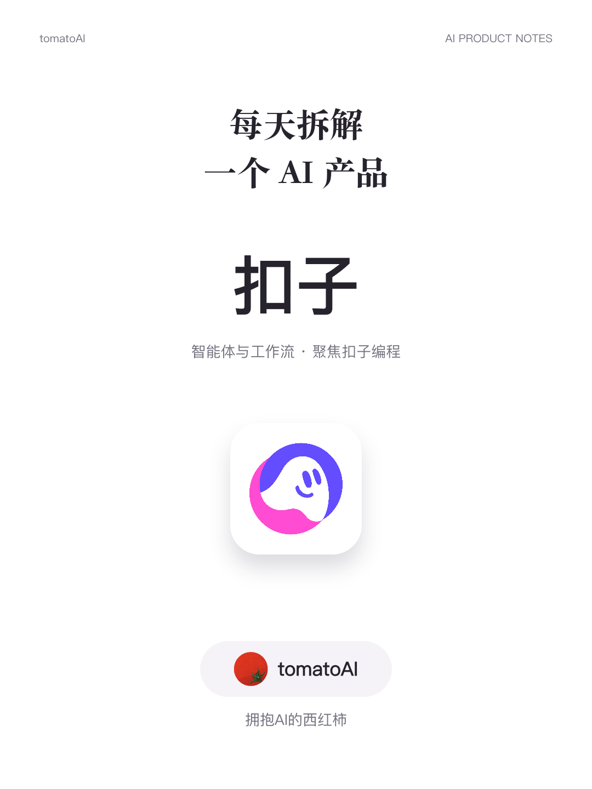
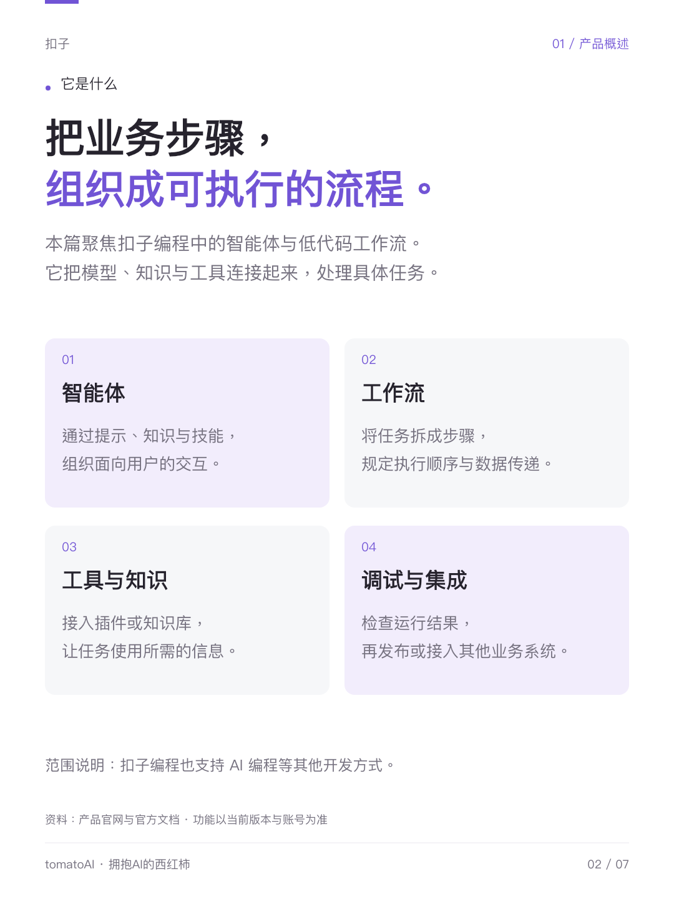
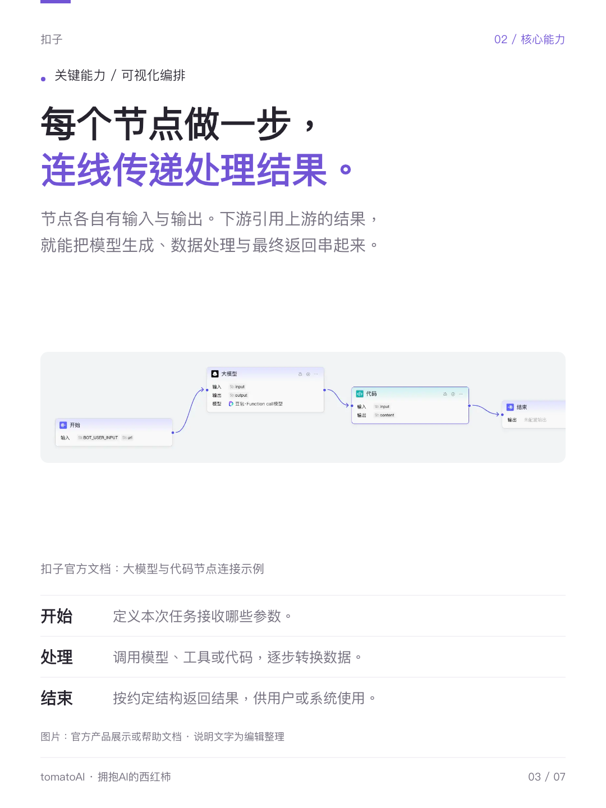

# 小红书 AI 产品拆解 Skill

把产品资料整理成**可阅读、可追溯的小红书图文**：竖版图片、发布标题、结构化正文和 Tag。

这是一个可安装的 AI Skill，GitHub 仓库是它的分发载体。技能标识 `xiaohongshu-product-breakdown` 意为“小红书产品拆解”。主要说明与生成内容使用中文。

## 能做什么

- 根据官方资料拆解 AI 模型、Agent、创作工具、搜索产品及具身智能产品。
- 用具体任务、输入输出、差异与限制解释产品，区分官方说明、演示、实测和编辑判断。
- 生成默认 1080 × 1440 的编号 PNG、纯图片 ZIP、标题、文案与 Tag。
- 可配置自己的头像、账号名和栏目；未提供身份时省略署名。
- 按信息调整篇幅，不硬凑七页；只改文案或回复评论时不重新制作整套图片。

**不生成 HTML，不自动发布到小红书，不包含登录凭证或付费 API。** 成品示例保留作者署名；制作自己的内容时使用自己的账号配置，不复用示例身份。

## 先看成品：扣子 Coze

下面是此前制作的一套 **7 页图文**，展示封面、信息分块、真实界面与任务说明如何组合。图片整理于 **2026-09-11**，用于展示输出效果，产品能力与界面以使用时的官方资料为准。

| 封面 | 产品概述 | 工作流与真实界面 |
| --- | --- | --- |
| [](examples/coze/images/01.png) | [](examples/coze/images/02.png) | [](examples/coze/images/03.png) |

**[查看完整 7 页与示例说明](examples/coze/README.md)** · [配套文案与 Tag](examples/coze/caption.md) · [素材来源](examples/coze/sources.md)

这套示例展示一种已有排版，页数、配色、字号和内容结构可按主题调整；账号头像和名称也由使用者自行配置。

⭐ 如果这套 Skill 对你有帮助，欢迎点一下仓库右上角的 **Star**，方便下次找到，也支持后续继续完善示例和流程。

## 安装

### Codex

将完整仓库放入本地 skills 目录，文件夹名保持 `xiaohongshu-product-breakdown`：

```sh
git clone https://github.com/xibei8144-xb/xiaohongshu-product-breakdown.git \
  "${CODEX_HOME:-$HOME/.codex}/skills/xiaohongshu-product-breakdown"
```

已有同名目录时先保留自己的修改，不要直接覆盖。也可以在 GitHub 的 **Code → Download ZIP** 下载后解压，将含有 `SKILL.md` 的目录改成上述名称并放入 skills 目录。

如果技能列表未刷新，开启新会话后使用：

```text
使用 $xiaohongshu-product-breakdown 拆解小红书 AI 点点，
面向普通小红书用户，重点解释能做什么、怎样使用和关键差异。
生成图片、配套文案和 Tag，不拆价格。
```

### 其他 AI 工具

支持本地 Skill 的工具可按其说明导入整个目录；只支持文件上下文的工具可读取 `SKILL.md` 及其引用文件。宿主需提供联网研究、文件读写、脚本运行和图片检查能力。**尚未验证所有工具的自动发现机制，不承诺直接兼容所有平台。**

## 常见用法

```text
拆一下 [产品名]。先核实官网，使用真实产品素材，按内容决定页数。
```

```text
只改配套文案：用 3—5 个短段讲清实际用途，增加少量 emoji 和相关 Tag。
```

```text
拆一下 [机器人型号]。重点讲功能、目标用户、型号差异，分清受控演示与实际使用条件。
```

品牌配置为可选项。复制 `assets/brand.example.json` 到工作目录，填写账号名和自己的头像路径；详细字段见 [安装与账号配置](references/setup.md)。不要把示例中的“你的账号名称”直接用作署名。

## 可选：运行图片排版示例

Skill 指令可独立使用；附带的 Canvas 脚本只是**可修改的七页历史布局**，不是自动适配任意文案的排版引擎，也不负责联网研究。

环境：Node.js 20 或以上、Python 3.10 或以上、可用中文字体。依赖为 `@napi-rs/canvas`；打包器仅使用 Python 标准库。

```sh
npm ci
# 按需下载历史示例对应的官方素材，仅供本地验证；需要联网。
python3 scripts/fetch_example_assets.py
node scripts/render.cjs --content assets/example-content.json \
  --assets assets/example-media --out ./demo-output
python3 scripts/package.py --content assets/example-content.json --out ./demo-output
```

再次渲染需使用新的输出目录。素材链接可能失效；失败时按来源文件查找可用官方素材，不用虚构界面替代。示例中的产品内容是历史资料，不能作为当前能力结论。

中文字体无法自动识别时设置 `XHS_FONT_PATH`；已有 Canvas 模块可用 `XHS_CANVAS_MODULE` 指定。Windows 可用 `py -3` 替代 `python3`，完整说明见 [环境配置](references/setup.md)。

## 文件结构

```text
SKILL.md                    技能入口与工作范围
agents/openai.yaml          Codex 展示名称和调用示例
references/                 研究、文案、排版与配置规则
assets/brand.example.json   可选账号配置示例
assets/example-content.json 历史内容结构示例
assets/example-media/       第三方素材来源清单；图片不随仓库分发
examples/coze/             扣子历史成品：7 张原图、总览、文案与来源
scripts/render.cjs          原生 PNG 排版参考
scripts/package.py         输出校验和图片打包
scripts/fetch_example_assets.py  按需获取示例素材
tests/smoke.py              不依赖官方素材的渲染与打包检查
```

## 输出与质量检查

每款产品输出编号图片、图片 ZIP、文案、来源记录及总览。图片包不包含源码或研究文件。

自动检查验证页序、尺寸和打包结构，不能判断审美或完整发现文字重叠。交付前仍需人工或视觉工具检查封面、截图页与文字密集页。改变内容长度或页数时，必须同步适配渲染布局。

```sh
node --check scripts/render.cjs
python3 tests/smoke.py
```

测试使用独立临时目录和合成占位素材，不下载第三方图片、不发布内容。中文字体需在本机准备；以上检查已在制作环境运行，其他系统仍需验证依赖与字体。

## 反馈与贡献

欢迎通过 Issues 提交问题，或通过 Pull Request 提交改进。报告排版问题时，请附脱敏输入、运行环境、命令和问题截图；不要上传真实账号凭证或私人素材。修改脚本后运行上述检查；修改规则时说明它解决的具体使用问题。

## 许可证与第三方素材

原创代码与文档使用 [MIT License](LICENSE)。第三方商标、产品 Logo、截图和字体不属于本仓库的 MIT 授权范围；来源及使用说明见 [THIRD_PARTY_NOTICES.md](THIRD_PARTY_NOTICES.md)。本项目不是小红书或示例产品的官方项目，不代表其背书。
