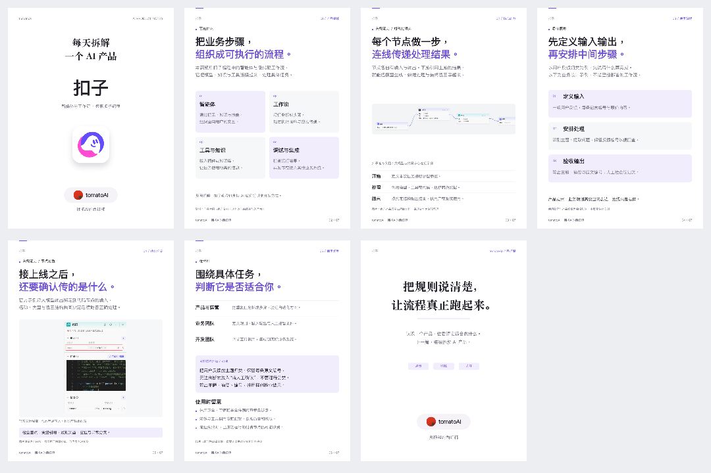
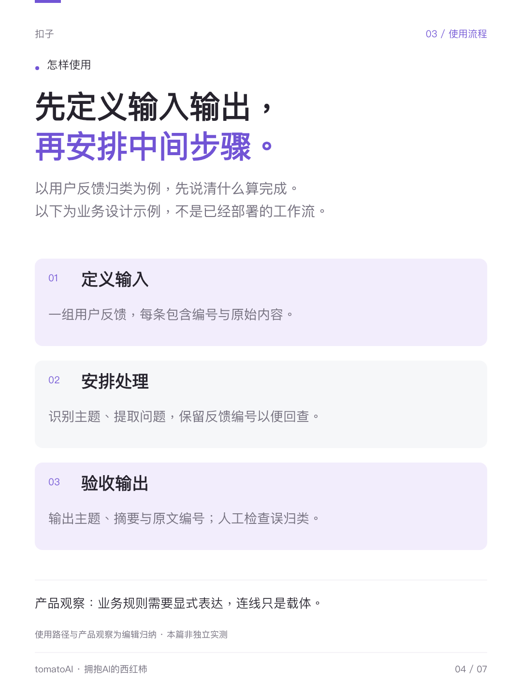
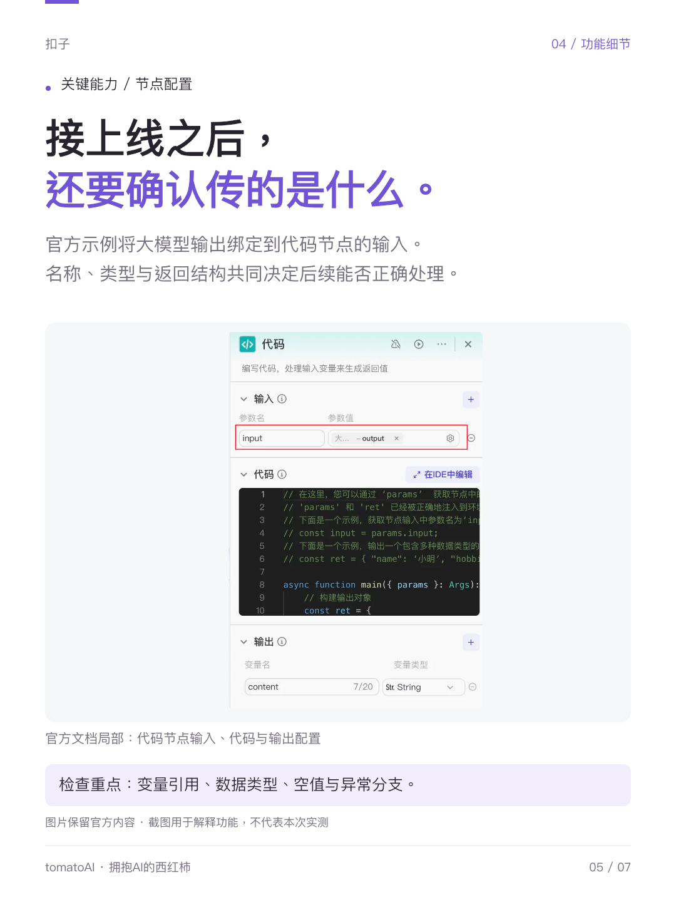
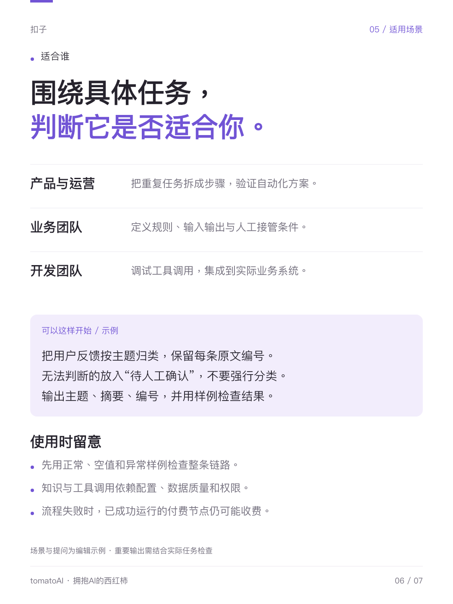
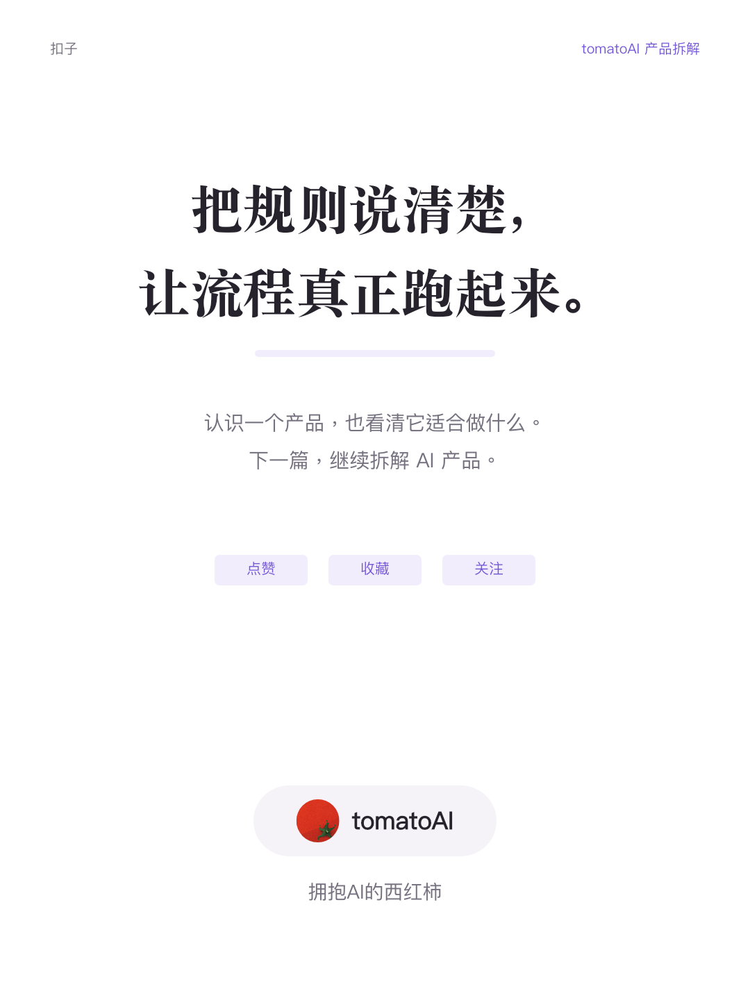

# 扣子 Coze：完整图文示例

这是一套在 **2026-09-11** 制作的历史成品：7 张 1080 × 1440 PNG，加上配套发布文案与 Tag。此次收录沿用原图，未重新绘制头像或产品界面。

适合参考的是信息顺序、分块排版、真实截图与解释文字的结合。产品信息是当时的资料整理，未独立实测；使用 Skill 制作新内容时，应重新核实官方资料。这套历史示例不要求其他作品固定为七页，也不代表所有细节都是唯一推荐做法。

## 整套总览

## 原图与内容安排

点击页码或图片查看原图。

| 页面 | 这一页说明什么 | 原图预览 |
| --- | --- | --- |
| [01 · 封面](images/01.png) | 栏目、产品名称、官方标识与账号署名。 |  |
| [02 · 产品概述](images/02.png) | 智能体、工作流、工具与知识、调试与集成的关系。 |  |
| [03 · 工作流](images/03.png) | 结合官方界面，说明节点与连接怎样传递输入输出。 |  |
| [04 · 任务示例](images/04.png) | 用用户反馈归类，解释定义输入、安排处理、验收输出。 |  |
| [05 · 代码节点](images/05.png) | 结合代码节点界面，解释输入引用、数据类型和输出结构。 |  |
| [06 · 适用场景与边界](images/06.png) | 将角色、具体任务和使用限制放在一起，帮助判断是否适合。 |  |
| [07 · 收尾](images/07.png) | 核心观点与点赞、收藏、关注入口。 |  |

## 配套文件

- [发布标题、正文与 Tag](caption.md)：保留历史成稿，参考结构时请替换产品信息和账号身份。
- [素材来源与使用说明](sources.md)：区分官方展示与编辑示意。
- [返回仓库首页](../../README.md)：安装与使用方法。

图中的 tomatoAI 为作者账号，仅用于案例展示。制作自己的内容时，使用自己的头像和名称；产品 Logo 与官方截图不属于仓库 MIT 许可证的授权范围。
